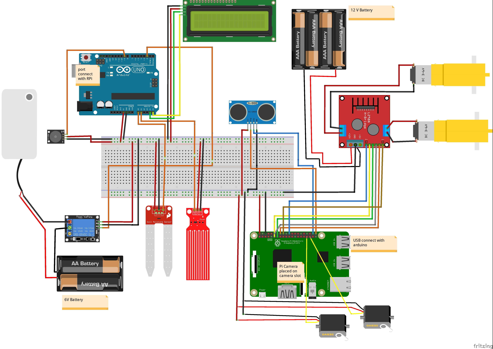

# PlantPal: Automated Irrigation Robot

**Automated Irrigation Robot**  
**Spring 2024**  
**Team: Group 05**

## Overview
PlantPal is a smart irrigation system designed to optimize water usage for plants by automating the irrigation process based on real-time environmental data. The system uses a combination of **Raspberry Pi**, **Arduino**, and various sensors to monitor soil moisture, water levels, and plant presence, ensuring plants receive just the right amount of water.

## Features
- **Automated Plant Detection**: Utilizes a Pi Camera and machine learning algorithms to detect plants.
- **Soil Moisture Monitoring**: Arduino collects real-time soil moisture data to decide when to water.
- **Water Level Monitoring**: The water level in the robot is tracked to prevent under-watering.
- **Robotic Arm for Watering**: A robotic arm positions itself accurately to water plants as needed.
- **Efficient Navigation**: An ultrasonic sensor helps navigate the robot towards the plants.

## Project Workflow

1. **Plant Detection**: Machine learning is used with a Pi Camera to detect and locate potted plants.
2. **Robot Movement**: The robot navigates towards the plant using the ultrasonic sensor.
3. **Watering Decision**: Soil moisture levels are monitored, and based on the data, the robot waters the plant.
4. **Watering Execution**: A motorized watering mechanism controlled by Arduino executes the irrigation.
5. **Water Level Monitoring**: A water-level sensor ensures the robot has sufficient water for irrigation.
6. **Feedback Loop**: Post-watering, soil moisture levels are reassessed to stop irrigation if the soil is adequately hydrated.

## Components Used

- **Raspberry Pi**
- **Pi Camera**
- **Ultrasonic Sensor**
- **Soil Moisture Sensor**
- **Water Level Sensor**
- **Arduino UNO**
- **DC Motor & Servo Motors**
- **16x2 Serial LCD Display**

## Circuit Design

## Communication Between Components
The communication between **Raspberry Pi** and **Arduino** occurs via UART protocol. Soil moisture and water level sensors are interfaced with the Arduino, while the Pi Camera and ultrasonic sensor are connected to the Raspberry Pi for real-time detection and decision-making.

## System Block Diagram
The system is designed with three key components:
1. **Detection and Navigation**: Camera and ultrasonic sensors detect and navigate to plants.
2. **Decision Making**: Soil moisture levels determine whether irrigation is required.
3. **Irrigation**: Robotic arm waters the plant based on the sensor data.

## Cost Estimation

| Item                          | Cost (Tk) |
|-------------------------------|-----------|
| Raspberry Pi                  | 12,000    |
| Pi Camera                     | 880       |
| Ultrasonic Sensor              | 93        |
| Arduino UNO                   | 1,010     |
| Soil Moisture Sensor           | 280       |
| Water Level Sensor             | 350       |
| LCD Display (16x2)            | 340       |
| Jumper Wires                  | 60        |
| Breadboard                    | 160       |
| Water Pump                    | 150       |
| Servo Motors                  | 180       |
| DC Geared Motors              | 170       |
| Relay Switch                  | 75        |
| Other materials               | 350       |
| **Total Cost**                | **15,287 Tk**|

## Conclusion
This project showcases the integration of sensor technology and robotics in agriculture to improve efficiency and sustainability. By automating irrigation based on real-time data from soil moisture, potted plant detection, and water level sensors, PlantPal optimizes water usage while ensuring that plants receive adequate hydration.

## Future Work
- Scaling the project for larger farms.
- Implementing remote control and monitoring capabilities through a mobile app.
- Enhancing machine learning algorithms for more accurate plant detection.
